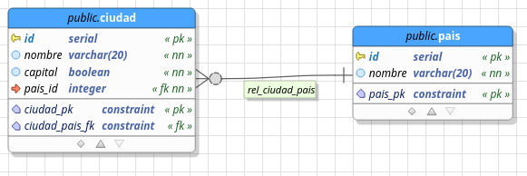

# ciudades_oas_crud 
api de beego para realizar las operaciones crud del modelo de datos descrito en la imagen sobre una base de datos postgres, con el fin de poner en practica los lineamientos y practicas vistos en la capaitacionde la OAS.
### requisitos:
- postgres 9.5 y pgmodeler
- Go y beego
- Montar la base de datos de la imagen en una bd postgres con el nombre **oas_ciudad_pais** 


### instrucciones para despliegue del servidor
- exportar la base de datos generada con pgmodeler a un servidor postgres usando el [archivo dbm suministrado en el proyecto](modelo_datos.dbm) 
- en una terminal ubicada en la carpeta del proyecto correr el siguiente comando:
```shell
 bee run
 ```
 para generar la documentacion del API con swagger se correra el comando:
 ```shell
bee run -downdoc=true -gendoc=true
 ```
 - el servidor comenzara a escuchar peticiones en el puerto 8080 listo para recibir peticiones de aplicaciones cliente
